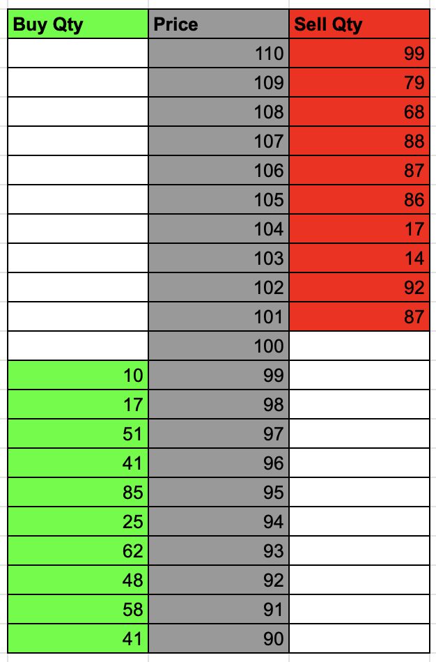
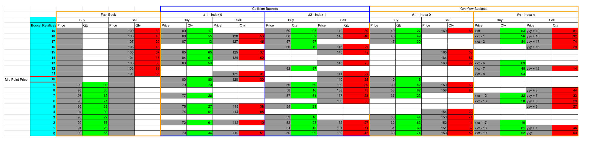

# HashOrderBook (Concept / Work in progress)
Here this project having a go at tackling some of the data challenges of the financial markets 'order book' directly. Rather than using existing associative containers from C++ standard template library, we look to create something bespoke which fulfils the needs of the concept directly to avoid any pitfalls or generalized implementation.

### What are the needs & challenges
 1 - Order retrieval. Other data structures (e.g. std::map) support this though the penalty is on tree traversal on insert/update/delete with O(log n) complexity.
 
 2 - Fast look up times. Ideally O(1) lookup. std::unordered_map supports this but lacks ordered retrieval. 
 
 2 - Fast insertion and deletion. Again ideally O(1) complexity. 
 
 2 - Cache friendliness. Plenty of structure fulfils this need. In this project we aim to fulfil this need also.
 
 4 - Memory density. Ideally the data structure shouldn't need to be enormous to fulfil any of the above needs. It should also be able to grow and shrink as data is added and removed

### Order Book.
I don't want to explain what an order book is, but I like the concept of a contiguous set of prices when it's displayed like this, because the concept works well for the HashOrderBook data structure.


### HashOrderBook design
The idea here is to leverage some ideas from hashmap. 
Commonly a hashmap is implemented as a set of contiguous buckets which can be indexed from 0 to n. 
Data is stored and retrieved by computing a hash on the key which indexes into the buckets. The trick is to wrap the hash at the length n by applying a modulo calculation on the hash before using it to index. 
Any buckets where the hash of two keys collides both entries are stored on the same but but are chained together (in the case of std::unordered_map it's a list. Other forms of hash maps can employ other mechanisms to deal with collisions).
A hash map will also keep track of a load value, which is the number of items in the collection divided by the number of buckets.
When a threshold on the load factor is crossed all items in the map are rehashed after extending the number of buckets.

When a hashmap wraps the index around on the bucket count, it loses something, which is the number of times this wrapping occurs. i.e. hash divided by bucket count. 

The HashOrderBook takes from some of these concepts.
It works in layers. Firstly it defines a static set of buckets called the 'fast book' size. Each bucket can contain a price & bid or offer quantity. 
Each bucket also contains a pointer to a second smaller array called the 'collision buckets'. Typically this would be something like 2-4 in size and also allows price and bid and offer qty. 
Finally each bucket contains a pointer to a list of buckets called the 'overflow buckets'. This is the last layer and provides a dynamic but slightly slower storage from the first two locations.

```
template<class Key, class Value, Key tick_size, size_t fast_book_size, size_t collision_buckets> 
class HashOrderBook{
public:
   HashOrderBook(const Key& hashing_mid_price)
};
```
The HashOrderBook requires a midpoint price when constructed and a tick size as a template argument.
To index a value the hash is computed as a relative index in 'ticks' from the midpoint price. E.e if the fast book size is say 10, and the midpoint price is 100 and the insert of a Bid at price 103 is calculated to be an index of 8. i.e. 10 / 2 give the mid and (price - mid price) /tick size + mid gives 8.  

If the index is greater than the bucket size of 'fast book' the index will wrap around but in doing so we compute a collision index. 1 for the first wrap and 2 for the second and so on. 
If the index is negative it wraps positively around. e.g. an index -1 will wrap around to 9 and give us a collison index of 1.

The collision index if greater than 0 and less than or equal to collision_buckets will index into collision buckets.
If the collision index is greater than collision_buckets it will use the 'overflow buckets'.

This way the prices closest to the midpoint price are fastest to access.

There is one caveat in that the layered approach is only reserved for prices which are 'worse' than the mid (bid - lower prices, ask - higher prices). If a bid price goes high and wraps around it goes straight to using the 'overflow buckets'. Same for the lower ask prices which wrap. 
Via this mechanism the collection support quick large moves and crossed order books. But in the case of large moves the collection should be rehashed.


Rehashing involves using a new midpoint price to generate new index values for hash and collision bucket to re-centre the prices around this midpoint. 

### Todo
potentially auto rehash on insert and maybe erase.
### Memory usage
Below is an attempt to diagram a real-life exampe based off the blow code...
```
HashOrderBook<int, int, 1, 10, 2> book(100);
```



You can see from the above diagram where there are gaps in price levels there is some wasted memmory, though its a trade off between using the collection to store enough space for 'book' and 'collision buckets' which are static, and 'overflow buckets'. The section for 'overflow buckets' in the diagram looks like its waiting memory, but this is not the case. Was just difficult to depict the layout exactly as it looks.

To give an iea of the memory usage the 'fast book' will use, it will 696 bytes for an 8 bit price type, 8 bit quantity type with 'fast book' of size 10 and a 'collision buckets' of 3. 
The memory footprint of the 'fast book' is kept to a minimum by keeping pointers to the collision and overflow buckets, both of which are allocated to the heap. 
The fast book itself does not request heap memory, and will consume memory of the the prevailing memory allocation mechanism, i.e stack for functions, or data section for globals, or heap where appropriate if allocated as part of an object.

Total memory usage of a newly constructed book for the above combination is 1,600 bytes. This is the total of the 696 bytes of static data, and the additional memory used by stucturs on the heap. This is the total base footprint used by the collection. Any additions or deletions of data to the 'overflow buckets' will cause the collections total footprint to grow and contract. any additions to 'fast book' or 'collision buckets' will have no change.
