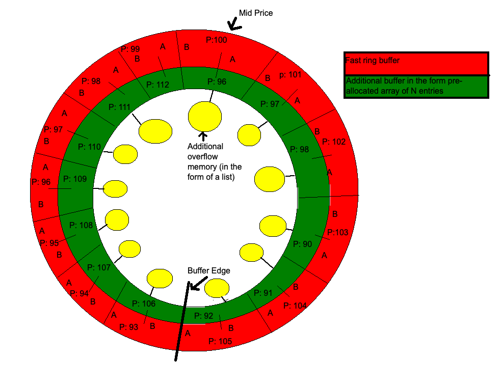

# HashOrderBook (Concept / Work in progress)
Here this project looks to directly tackle some of the data challenges of the financial markets 'order book' directly. Rather than using existing associative containers from C++ standard template library, we look to create something bespoke which fulfils the needs of the concept directly to avoid any pitfalls or generalized implementation.

### What are the needs & challenges
 1 - Order retrieval. Other data structures (e.g. std::map) support this though the penalty is on tree traversal on insert/update/delete with O(log n) complexity.
 
 2 - Fast look up times. Ideally O(1) lookup. std::unordered_map supports this but lacks ordered retrieval. 
 
 2 - Fast insertion and deletion. Again ideally O(1) complexity. 
 
 2 - Cache friendliness. Plenty of structure fulfils this need. In this project we aim to fulfil this need also.
 
 4 - Memory density. Ideally the data structure shouldn't need to be enormous to fulfil any of the above needs. It should also be able to grow and shrink as data is added and removed

### Order Book.
I don't want to explain what an order book is, but I like the concept of a contiguous set of prices when it's displayed like this, because the concept works well for the HashOrderBook data structure.


### HashOrderBook design
The idea here is to leverage some ideas from hashmap. 
Commonly a hashmap is implemented as a set of contiguous buckets, index-able from 0 to n. 
Data is stored and retrieved by computing a hash on the key which indexes into the buckets. The trick is to wrap the hash at the length n by applying a modulo calculation on the hash before using it to index. 
Any buckets where the hash of two keys collides are chained together (in the case of std::unordered_map its a list. Other forms of hash maps can employ other mechanisms to deal with collisions).
A hash map will also keep track of a load value, which is the number of items in the collection divided by the number of buckets.
When a threshold on the load factor is crossed all items in the map are rehashed after extending the number of buckets.

When a hashmap wraps the index around on the bucket count, it loses something, which is the number of times this wrapping occurs. i.e. hash divided by bucket count. 

The HashOrderBook takes from some of these concepts.
It works in layers. Firstly it defines a static set of buckets called the 'fast book' size. Each bucket can contain a price & bid or offer quantity. 
Each bucket also contains a pointer to a second smaller array called the 'collision buckets'. Typically this would be something like 2-4 in size and also allows price and bid and offer qty. 
Finally each bucket contains a pointer to a list of buckets called the 'overflow buckets'. This is the last layer and provides a dynamic but slightly slower storage from the first two locations.

```
template<class Key, class Value, Key tick_size, size_t fast_book_size, size_t collision_buckets> 
class HashOrderBook{
public:
   HashOrderBook(const Key& hashing_mid_price)
};
```
The HashOrderBook requires a midpoint price when constructed and a tick size as a template argument.
To index a value the hash is computed as a relative index in 'ticks' from the midpoint price. E.e if the fast book size is say 10, and the midpoint price is 100 and the insert of a Bid at price 103 is calculated to be an index of 8. i.e. 10 / 2 give the mid and (price - mid price) /tick size + mid gives 8.  





